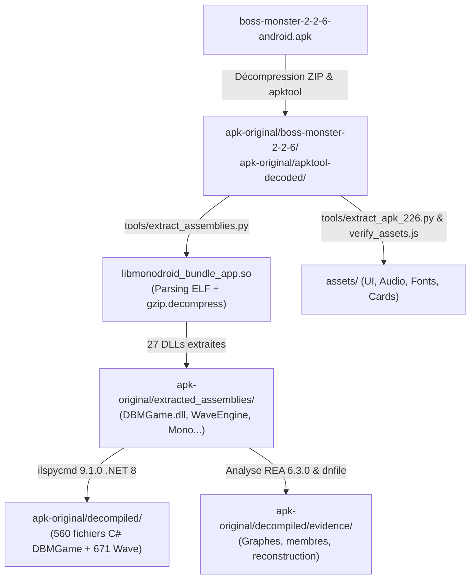

# Rapport Complet de Décompilation — APK Boss Monster 2.2.6

**Date :** Octobre 2026  
**Cible :** `boss-monster-2-2-6-android.apk`  
**Projet récepteur :** `monster_boss` (remake web React / Node.js & port Godot 4)  
**Méthode :** Analyse statique hors ligne, extraction binaire ELF, décompilation CIL / .NET, validation formelle REA.

---

## 1. Fiche d'Identité de l'APK Original

| Métadonnée | Valeur vérifiée |
|---|---|
| **Fichier binaire** | `apk-original/boss-monster-2-2-6-android.apk` |
| **Taille** | 47 679 680 octets (~45,5 Mo) |
| **Empreinte SHA-256** | `78592B483D8C7C4B8AABA1095F855226344565FB3D1B112A48113C2E90852FFD` |
| **Package Android** | `com.dbm.project` |
| **Version Name / Code** | `2.2.6` (versionCode : `131298`) |
| **Niveau API Android** | `minSdk 11` (Android 3.0), `targetSdk` legacy |
| **ABI / Architecture** | `armeabi-v7a` (ARM 32 bits uniquement) |
| **Moteur graphique** | **WaveEngine** (moteur C# .NET multiplateforme) |
| **Framework runtime** | **Xamarin.Android** / Mono Runtime (`mono.android.app.Application`) |
| **Multi-joueur original** | **Photon Engine** (`Photon3DotNet`, `PhotonLoadbalancingApi`) |
| **Nombre d'entrées zip** | 123 entrées brutes |

---

## 2. Découverte Architecturale : Le Piège du "Bundling" Mono

Une analyse préliminaire via les outils Android classiques (`apktool`, `jadx`) montre un paradoxe :
- `classes.dex` est très restreint (249 Ko, 196 fichiers smali).
- Aucune classe de logique métier de jeu n'existe dans le bytecode Dalvik/ART.
- Le DEX ne sert que de bootstrap Mono : `MonoRuntimeProvider`, `md5...AndroidActivity`, ainsi que les wrappers de télémétrie (`UbertestersScreen`) et d'in-app purchase (`play.billing.v3`).

### Localisation du code métier : `libmonodroid_bundle_app.so`
Dans les builds Release Xamarin.Android avec l'option `bundle assemblies`, Mono fusionne toutes les bibliothèques managées (.NET) dans une bibliothèque partagée native ELF :
- Chemin : `apk-original/boss-monster-2-2-6/lib/armeabi-v7a/libmonodroid_bundle_app.so` (3 153 388 octets).
- Les fichiers `.dll` managés ne se trouvent pas dans le dossier standard `assemblies/` de l'APK, mais sont intégrés directement sous forme de symboles ELF nommés `assembly_data_<nom_de_dll>` compressés au format gzip.

---

## 3. Chaîne d'Outillage et Méthodologie d'Extraction

Pour reconstruire l'intégralité du code et des données, un pipeline d'outils sur-mesure a été mis en œuvre :



### Étape 1 : Décodage ELF et extraction des 27 DLLs (`tools/extract_assemblies.py`)
Le script parse les sections ELF (`SHT_SYMTAB`, `SHT_DYNSYM`) et la table `bundled_assemblies` (débutant à l'offset `3148128` dans le `.so`). Il identifie chaque symbole `assembly_data_*` et extrait le flux gzip :
- **27 assemblages extraits avec succès (100% sans perte) :**
  - **Jeu métier :** `DBMGame.dll` (888 832 octets, SHA-256 `7bf2ae019338...`, MVID `e562af39-0d3b-4469-a29c-d41e4746a53b`).
  - **Moteur WaveEngine (8 DLLs) :** `WaveEngineAndroid.Adapter`, `Bepu`, `Common`, `Components`, `Farseer`, `Framework`, `Materials`, `Physics`.
  - **Framework de base :** `mscorlib.dll` (1,8 Mo), `Mono.Android.dll` (923 Ko), `System.dll`, `System.Core.dll`, `System.Xml.dll`, etc.
  - **Réseau & Tiers :** `Photon3DotNet.dll`, `PhotonLoadbalancingApi.dll`, `Newtonsoft.Json.dll`, `OpenTK.dll`, `play.billing.v3.dll`, `Xamarin.Insights.dll`, `Zlib.Portable.dll`.

### Étape 2 : Décompilation CIL vers C# (`ilspycmd`)
- Utilisation de `ilspycmd` 9.1.0.7988 en mode projet sous .NET 8.
- **Résultat dans `apk-original/decompiled/` :**
  - `DBMGame/` : **560 fichiers `.cs`**, 54 402 lignes de code, 59 espaces de noms.
  - `Wave/` : **671 fichiers `.cs`**, 73 087 lignes de code.
  - Autres assemblages : **20 dossiers**, 3 684 fichiers `.cs`.
  - **Taux de complétion :** 4 915 fichiers générés, 0 marqueur d'échec de décompilation, 640/640 types CIL résolus.

### Étape 3 : Formalisation et Preuves Cryptographiques (REA 6.3.0)
Dans `apk-original/decompiled/evidence/` :
- `managed_members_DBMGame.json` (38 Mo) : 918 TypeDef et 5 704 MethodDef indexés avec leurs tokens métadonnées et signatures CIL.
- `reconstruction_import.json` : 64 méthodes critiques du moteur de jeu verrouillées (token CIL + empreinte SHA-256 + IL normalisé).
- `managed_graph.json` (51 Mo) : cartographie relationnelle exhaustive (appels inter-méthodes, dépendances de types).

---

## 4. Cartographie Fonctionnelle du Code Métier (`DBMGame.dll`)

L'assemblage `DBMGame.dll` concentre l'ensemble des règles physiques, de l'IA et de l'orchestration du jeu original.

```
DBMGame.dll (918 types, 5704 méthodes)
├── DBMGameModel.Logic/             -> Cœur des règles (GameBoard, Boss, DungeonSlot, Hero, Item)
│   ├── Abilities/                  -> Architecture déclarative d'effets (transactions, états)
│   │   ├── Commands/ (49)          -> Commandes exécutables (AddSouls, BuildRoom, DestroyRoom...)
│   │   ├── Targets/ (33)           -> Cibles (AdjacentsRoom, AllBoss, ActiveHeroInDungeon...)
│   │   ├── Triggers/ (13)          -> Déclencheurs (WhenAnotherRoomIsDestroyed, WhenBuilt...)
│   │   ├── Conditions/ (8)         -> Prédicats d'activation (DuringPhase, OncePerTurn...)
│   │   └── LuredConditions/ (6)    -> Conditions d'attirance des héros (Souls, Treasures...)
│   ├── LogicLogger/                -> Journalisation et actions d'arbitrage
│   └── OnlineModels/ (12)          -> DTOs de synchronisation multi-joueur
├── DBMGameProject.AI/              -> Intelligence Artificielle adverse
│   ├── FixedAI, RandomAI, StatisticAI
│   └── Statistics/                 -> RoomCalculator, AbilityCalculator, TriggerCalculator
├── DBMGameProject.Scenes.GamePlay/ -> Gestion de scène WaveEngine (GamePlayBaseScene, HUD)
├── DBMGameProject.Services.Online/ -> Client Photon (OnlineClient, OnlineFlowManager)
└── DBMGameProject.Storage/         -> Sauvegarde locale et paramètres utilisateur
```

### Points Clés Révélés par le Code Décompilé :

1. **Machine à états des phases (`GameBoard.cs`) :**
   - 13 phases ordonnées : `Setup_a`, `Setup_b`, `Setup_c`, `BeginningOfTurn`, `BuildPhase_a`, `BuildPhase_b`, `BaitPhase`, `AdventurePhase_a`, `AdventurePhase_b`, `AdventurePhase_c`, `EndOfTurnPhase`, `EndOfGame`, ainsi que `ExtraBuildPhase`.
   - Boucle de priorité d'action stricte : le joueur actif résout ses triggers en premier, mais la fenêtre de réponse aux sorts (*Spell Battle*) est ouverte à tous les joueurs vivants avec un mécanisme d'annulation et de transactions en attente (`PendingAbilityTransactions`).
   - Timings officiels : minuteur de 70 secondes pour la décision de construction/passe, 60 secondes pour le tour global, et 3 secondes par palier de salle lors de l'aventure.

2. **Moteur d'effets piloté par données (`AbilityFactory.cs`) :**
   - Contrairement aux approches procédurales (ex. grands `switch/case`), l'APK instancie ses effets à chaud par réflexion depuis le fichier JSON des cartes (`data.json`).
   - Une habilité est un quadruplet composé d'un `Trigger`, d'une `Condition`, d'une liste de `Targets` et d'une séquence de `Commands`.

3. **Intelligence Artificielle (`RoomCalculator.cs`) :**
   - Évaluation dynamique par phase de jeu :
     - *Early game* (Tour $\le 1$) : priorisation absolue des dégâts immédiats (`[0, 2.5, 10, 15, 17.5, 20]`) pour encaisser les premiers héros.
     - *Mid game* (Tours 2 à 4) : compromis dégâts et trésors.
     - *Late game* (Tours $> 4$) : course aux 10 âmes et blocage des adversaires.
   - Pénalité de sur-construction : pénalité sévère (-300 points) en cas d'écrasement involontaire d'une salle avancée.

---

## 5. Recensement et Couverture Complète des Assets

L'audit mené par `tools/check_full_coverage.py` et consigné dans `assets_full_coverage.md` atteste d'une **couverture de 100%** de l'ensemble des contenus de l'APK :

| Catégorie | Fichiers APK d'origine | Format / Traitement | Destination dans le projet |
|---|---|---|---|
| **Conteneurs WPK** | 93 fichiers `.wpk` | Validés (magie `WPK\0` + payload gzip) | Décompressés et convertis |
| **Effets Sonores (SFX)** | 42 fichiers WPK | Décompressés en flux PCM | `assets/audio/sfx/*.wav` (42 fichiers) |
| **Musiques** | 2 pistes MP3 | Extraction 1:1 sans ré-encodage | `assets/audio/music/*.mp3` (2 fichiers) |
| **Typographies** | 4 fichiers WPK | Extraction des tables TrueType | `assets/fonts/*.TTF` (4 polices dont *Arcadepix*) |
| **Textures & UI** | Atlas WPK (Common, NinePatch, Tutorial, Loading) | Conversion RGBA / ETC1 vers WebP | `assets/ui/**/*.webp` |
| **Données de Cartes** | 4 `data.json` + 3 `ai_info.json` | Parsing & fusion avec extensions | `src/backend/game/cardData.json` (442 entrées) |
| **Code natif & Dalvik** | `classes.dex`, `.so`, `AndroidManifest.xml` | Décodé en smali et XML lisible | `apk-original/apktool-decoded/` (archivé localement) |

> **Asset non résolu :** Le seul fichier mentionné dans le code C# mais absent de l'APK physique est `Common/marketItems.json`. Il s'agissait d'un fichier de configuration distant lié aux achats in-app Google Play, sans impact sur les règles du jeu.

---

## 6. Retombées Concrètes sur le Projet `monster_boss`

La décompilation intégrale a servi de boussole de vérité absolue pour corriger et aligner le remake :

1. **Corrections de Règles Majeures :**
   - **Ciblage de sorts trans-donjons :** Rectification de *Annihilator* (BMA040) et *Giant Size* (BMA047) pour autoriser le ciblage de salles dans le donjon de n'importe quel joueur (`PlayerTypes.Any`), et non plus uniquement le donjon du lanceur.
   - **Résolution LIFO de la pile :** Alignement du gestionnaire d'événements de sorts sur le modèle transactionnel de l'APK.
   - **Condition de victoire :** Rétablissement de la règle de départage d'égalité sur l'XP la plus élevée du Boss (et non la plus faible).
2. **Harmonisation de l'IA :**
   - Implémentation dans `src/backend/game/ai.js` des mêmes coefficients d'évaluation des salles que `RoomCalculator.cs`.
3. **Parité Graphique et Sonore :**
   - Réintégration de l'intégralité des sprites de boss, salles, héros, textures de donjon et effets sonores originaux, garantissant une fidélité audiovisuelle pixel-perfect.

---

## 7. Conformité et Hygiène du Répertoire

- **Isolation stricte :** Conformément au fichier `AGENTS.md` et au `.gitignore`, l'ensemble du dossier `apk-original/` (APK, DLLs extraites, C# décompilé, smali) est strictement maintenu hors du versionnement Git.
- **Docker :** Exclu via `.dockerignore` pour garantir des images de déploiement légères et exemptes de données tierces.
- **Autonomie :** Le projet fonctionne et s'exécute de façon 100% autonome sans la présence de l'APK grâce aux assets dérivés et aux fixtures de test versionnées (`tests/unit/fixtures/`).
